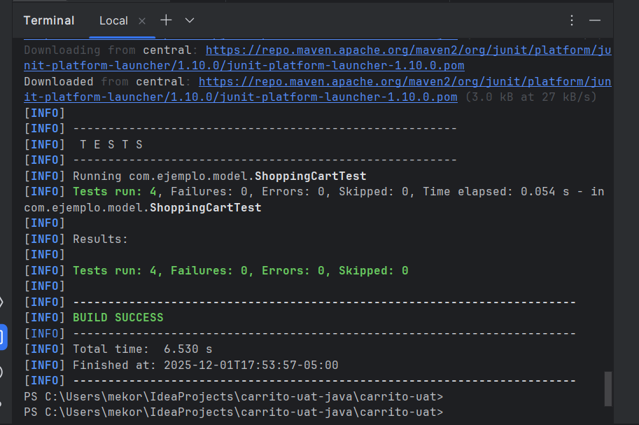

_**EVIDENCIAS
Resultados de mvn test**_

# Ejecución de pruebas:

**mvn test**

# ****

**Casos pasados y fallados**

Todas las pruebas de aceptación se ejecutaron correctamente. Los casos CA-01, CA-02, CA-03 y CA-05 pasaron sin errores, 
demostrando que las funciones principales del carrito operan como se esperaba. 
No se encontraron fallas durante la ejecución. Si en algún momento una prueba fallara, probablemente sería por errores 
en la lógica de cálculo de totales, manejo de cantidades o validación al eliminar productos del carrito.

Reflexión final

Aprendimos que las pruebas de aceptación permiten validar las funcionalidades desde el punto de vista del usuario, 
asegurando que cada historia cumpla con el comportamiento esperado. A diferencia de las pruebas unitarias, 
que evalúan métodos específicos de manera técnica, las pruebas de aceptación revisan el flujo completo y confirman que 
la funcionalidad aporta valor real. Si estas funcionalidades fallaran en producción, los usuarios podrían ver totales 
incorrectos, carritos vacíos o compras que no reflejan sus productos, lo que afectaría la experiencia y podría generar 
pérdidas. Por eso, este tipo de pruebas es fundamental antes de liberar cualquier módulo.
